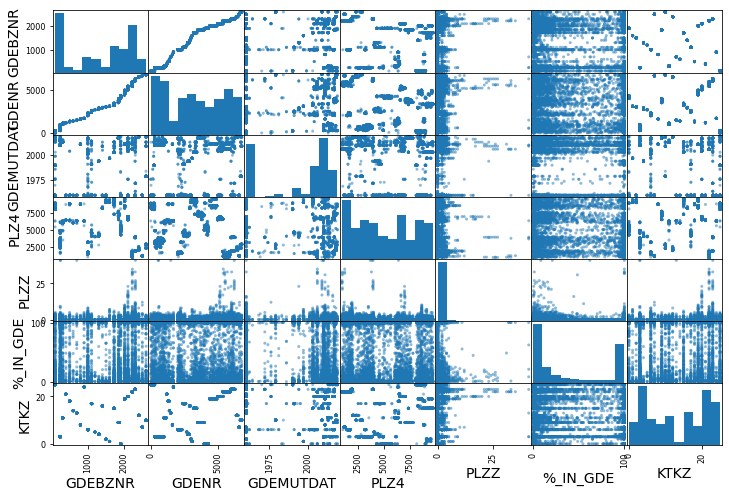
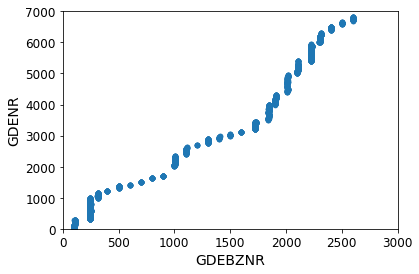

As interesting facts I have found the following:

Basel-Stadt and Glarus has the less number of political communities (3) and Bern is the one with more (346).

|Canton|Political communities|
|:--|:---|
|Aargau                    |211|
|Appenzell Innerrhoden     |  6|
|Appenzell Ausserrhoden    | 20|
|Bern                      |346|
|Basel-Landschaft          | 86|
|Basel-Stadt               |  3|
|Fribourg                  |137|
|Genève                    | 45|
|Glarus                    |  3|
|Graubünden                |106|
|Jura                      | 53|
|Luzern                    | 83|
|Neuchâtel                 | 31|
|Nidwalden                 | 11|
|Obwalden                  |  7|
|St. Gallen                | 77|
|Schaffhausen              | 26|
|Solothurn                 |109|
|Schwyz                    | 30|
|Thurgau                   | 80|
|Ticino                    |117|
|Uri                       | 20|
|Vaud                      |309|
|Valais                    |126|
|Zug                       | 11|
|Zürich                    |162|

***

Regarding the correlation between mostly of the columns within the dataset, I behold a strong linear correlation between the 'District Number' and the 'Political Community Number';

More in detail I can check that this correlation is positive, meaning that the community number will increase toguether with the district number where it belongs and viceversa;

***

About the political communities last update date;

- The median of updates are in 1994.
- The records started at 1960 and finished updated on 2019.
- Percentile 50 is in 2006 and percentile 75 is in 2011.
- Standar deviation: arround 22.

***

The next political communities doesn't have a related postal community;	

|GDEKT|	GDEBZNR|	GDENR|	GDENAME|	GDENAMK|	GDEBZNA|	GDEKTNA|	GDEMUTDAT|
|:-------|:-------|:-------|:-------|:-------|:-------|:-------|:-------|
|	FR|	1005|	2391|	Staatswald Galm|	Staatswald Galm|	Bezirk See / District du Lac|	Fribourg|	2004-01-01|
|	TI|	2101|	5391|	C'za Cadenazzo/Monteceneri|	C'za Cadenazzo/Montecen.|	Distretto di Bellinzona|	Ticino|	2010-11-21|
|	TI|	2105|	5394|	C'za Capriasca/Lugano|	C'za Capriasca/Lugano|	Distretto di Lugano|	Ticino|	2013-04-14|
